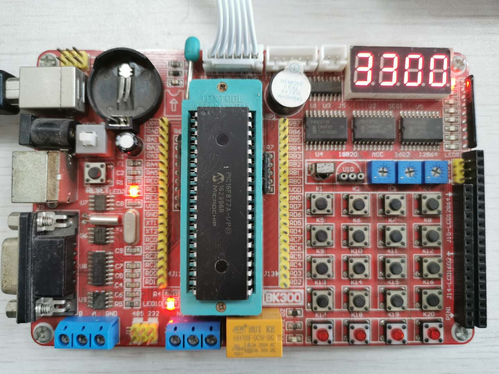

这是一个能在PIC16F877A开发板上运行的固定时间片轮询调度汇编程序代码。

**为什么要用时间片轮询调度？**

假如我们要写一个单片机程序，程序的目的就是用GPIO控制一个灯亮一秒再暗一秒…最简单的写法是用循环来计时，循环n次凑够一秒钟时间，然后去把GPIO的值反一下，然后再继续循环一秒钟…

这样写程序的问题就是，这个程序除了闪灯之外就啥也不能做了，给GPIO赋值只需要一秒钟执行一条指令，并没有消耗什么CPU资源。但CPU资源都浪费在了循环上。所以这种写法在实际应用中基本上是不可取的，而且这样计时也不够精确。

高级一点的写法是用单片机里面的硬件计时器，定时一秒钟，时间到了会触发中断，在中断响应程序中去赋值GPIO点灯。这样CPU在其它时间就空闲了可以干别的事情。但这样写法也有问题，那就是单片机里面的硬件计时器个数是有限的，如果有很多功能都需要定时，计数器不够了怎么办？

解决这个问题的一种方法就是时间片轮询调度法，调度的就是CPU的资源，也就是不同时间片会执行不同的程序。其实现在的操作系统底层都会用这种时间片调度法，也就是分时复用。某个时间片里执行的完成某项功能的程序就类似于一个线程。

**该程序干了啥？**

程序在开发板上实现了秒表，流水灯，按键检测等几个功能。具体可见代码前面的注释。流水灯一秒走一次，码表100ms加一，按键检测需要10ms检测一次按键值进行按键去抖，数码管需要2ms循环刷新。所以这个程序需要很多个不同时间的定时。其基本程序是一个200μs的时间片循环，然后通过对时间片进行计数，并对这些计数进行判断来决定该在合适调用哪个子程序。具体时间片的分布图，和程序流程图可见“TimeSlice流程图.vsd”文件。

